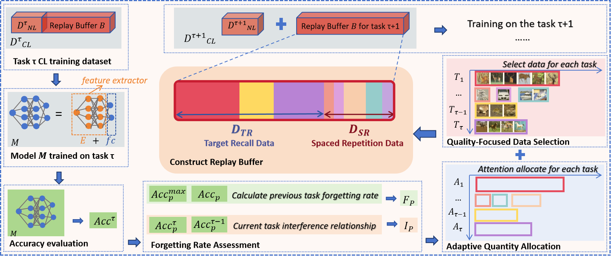

# CORE: Mitigating Catastrophic Forgetting in Continual Learning through Cognitive Replay
(Accepted by COGSCI 2024 Oral)

## Framework


This is a PyTorch implementation of the **CORE**


## Installation & requirements
The current version of the code has been tested with `Python 3.10.4` on a Fedora operating system
with the following versions of PyTorch and Torchvision:

* `pytorch 1.11.0`
* `torchvision 0.12.0`

Further Python-packages used are listed in `requirements.txt`.
Assuming Python and pip are set up, these packages can be installed using:

```bash
pip install -r requirements.txt
```


## Run
```bash
python main.py --replay=buffer --target=True
```
#### Settings
Custom individual experiments in the academic continual learning setting can be run with `main.py`.
The main options of this script are:

- `--experiment`: how to construct the context set? (`splitMNIST`|`CIFAR10`|`CIFAR100`)
- `--contexts`: how many contexts?

- `--seed`: seed count
